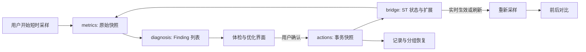

# 管家 2.0：可解释性能体检与治理设计

## 状态

- 日期：2026-08-11
- 目标版本：`1.0.0` 发布候选前完成
- 产品版本在真实 SillyTavern 验收完成前保持 `0.9.0`
- 本文只定义设计，不代表功能已经实现或通过真机验收

发布不着急，但验证不延期。管家 2.0 动工前先单独修复现有一键模式会把 `streaming_fps=10` 抬高到 15 的缺陷，并跑完当前 `CURRENT.md` 的 20 项真实 ST 验收。结果按旧代码头独立归档，`manifest.json` 仍保持 `0.9.0`。管家合入后再跑新增验收和相关回归，避免两批问题混在一起。

## 背景

当前“管家”主要是 SillyTavern 七个 `power_user` 性能字段的快捷入口，另显示已禁用扩展数和 Quick Reply 集合数。它能减少手工查找设置的成本，但没有回答三个更重要的问题：

1. 当前卡顿发生在哪一层。
2. 某项修改为什么值得做、会影响什么。
3. 修改前后是否真的改善，以及如何完整恢复。

正式版将管家升级为一个可解释、可逆、按风险分层的性能工具。核心闭环是：

> 测量 -> 诊断 -> 解释 -> 应用 -> 复测 -> 对比 -> 恢复

“Root 模式”保留为后续实验方向。正式版不通过猴子补丁伪装成系统权限，也不自动阻断未知扩展。

## 设计原则

### 只报告真实可观测数据

- 不生成无法解释的综合性能分数。
- 不把扩展安装体积当成运行时内存。
- 不把一次页面资源耗时直接解释为扩展长期 CPU 占用。
- 浏览器不支持 JS 堆、Long Task 或资源大小时，明确显示“当前环境不支持”，不补造估算值。
- 前后对比必须保留采样环境和工作负载说明；条件不可比时只并列数据，不下“提升百分比”结论。

### 每条建议都必须可解释

每个诊断项使用同一份结构化模型，至少包含：

- 检测到什么。
- 建议修改什么。
- 为什么可能改善性能。
- 可能影响哪些功能或视觉体验。
- 是否需要刷新页面或重启服务端。
- 如何恢复。
- 实施后的真实前后结果；尚未复测时显示“待复测”。

### 默认操作不改变生成语义

“一键安全优化”只处理视觉渲染、流式动画和消息 DOM 数量，不修改提示词、世界书、向量检索、总结策略、模型参数或扩展启用状态。

### 不降低用户已有优化

安全方案按当前值动态计算：

- 已经开启 No Blur、减少动画或关闭阴影时保持不变。
- 当前流式帧率已经低于建议值时不调高。
- 当前消息加载数在建议上限内时不调高；`0=全部加载` 才视为未限制。
- 每次应用只保存实际将变更的字段，并先记录可恢复快照。

### 功能性调整单独确认

扩展禁用、World Info、Vector Storage、Summarize 和服务端配置都不进入一键安全优化。它们必须单独说明影响、由用户确认，并使用独立快照恢复。

## 方案比较

### 方案 A：继续扩充快捷设置

在现有页面增加更多开关和说明。实现快、风险低，但仍然需要用户自己判断卡顿来源，也无法证明优化有效。它不能形成正式版的差异化价值。

### 方案 B：可解释体检 + 官方治理（采用）

建立短时采样、规则诊断、风险分层动作、前后对比和恢复记录；扩展管理只调用 SillyTavern 官方接口，并通过刷新后 A/B 排障建立更可靠的归因。

该方案能提供明显强于手工设置页的能力，同时仍处于普通前端扩展可稳定维护的边界内。

### 方案 C：启动防火墙 + 服务端伴侣

把同步阻断逻辑放进低 `loading_order` 加载器，或安装额外服务端组件修改 `config.yaml`。能力最强，但错误名单可能让控制器自身无法启动，且服务端组件会显著提高安装、权限和兼容成本。

该方案不进入 `1.0.0`。只有在方案 B 的真实数据证明官方治理仍不足时，才另立规格实现。

## 产品结构

手机主屏遵循仓库已有的“折叠区 + 复杂操作进全屏弹窗”约定，不新造五页签：

- 顶部常驻：环境摘要、“开始 6 秒体检”和当前采样状态。
- 折叠区：核心发现、建议变更、安全优化、复测结果和最近一次恢复入口。
- “完整报告”按钮：打开全屏报告与历史弹窗。
- “扩展排障”按钮：打开全屏扩展治理与 A/B 弹窗。
- “玩法与服务端顾问”按钮：打开独立顾问弹窗。

首次进入只做静态体检。动态采样仅在用户主动开始后运行，结束即释放观察器和计时器。主屏保持完成常见任务所需的最短路径，七段解释放在折叠详情或全屏弹窗里，避免手机视口被长文淹没。

## 四层体检模型

### 1. 页面与渲染

这一层合并消息 DOM、流式重绘和视觉设置，避免把同一组 rAF/Long Task 数据重复包装成多个层级。

可观测项：

- 当前聊天数据消息数、`#chat` 中已渲染 `.mes` 数和聊天区域 DOM 节点总数。
- 当前 `chat_truncation`、`smooth_streaming`、`stream_fade_in`、`streaming_fps`。
- No Blur、阴影、减少动画等正式 ST 设置。
- 前台采样中的 `requestAnimationFrame` 间隔分布和大于 50ms 的帧间隔次数。
- 浏览器支持时的 Long Task 次数、总时长和最长任务。
- 计时器延迟 P95 和正在运行的 CSS Animation 数量；API 不可用时省略。

浏览器前端无法可靠读取 GPU 显存或精确 GPU 占用，因此不展示这两项。管家也不把网络等待或模型生成耗时算成渲染耗时。

### 2. 媒体、资源与存储

可观测项：

- 图片、视频、音频、Canvas 和 iframe 的数量及可见/离屏状态。
- Resource Timing 中本次导航已经记录的脚本、样式、图片资源。
- 按 `/scripts/extensions/<name>/` 归组的传输大小和加载时长。
- `navigator.storage.estimate()` 支持时的站点存储用量与配额。

资源大小可能因缓存、跨域 Timing-Allow-Origin 或浏览器策略为零，界面必须显示该限制。`1.0.0` 只做诊断，不自动暂停用户正在播放的媒体，也不尝试控制 GIF。

### 3. 扩展

显示扩展类型、配置启用状态、manifest 依赖和已观察到的页面资源。`findExtension` 的启用只表示未列入禁用清单，不等于脚本已经成功激活；UI 不把两者混写。静态源码体积只作为下载与解析线索，不声称等于运行时开销。真正的归因依赖刷新后的 A/B 对比。

### 4. 生成与上下文

World Info、Vector Storage、Summarize、Regex 和其他生成拦截器可能显著影响准备提示词的工作量或最终玩法，但普通扩展无法安全地给每个拦截器单独计时。正式版只做：

- 读取可稳定获得的启用状态和数量。
- 说明它可能增加的工作及功能价值。
- 建议用户在独立 A/B 流程中验证。
- 将任何修改放入独立顾问弹窗并单独确认。

不得把整次生成耗时下降直接归因于某个前处理功能，因为模型和网络波动会污染结果。

## 已核实的 SillyTavern 接口

以下结论已对本机固定版本 `D:\6.YULE\ST\SillyTavern-1.18.0\public\scripts\extensions.js` 逐行核对，不属于待实现时猜测：

- `extensionNames` 在第 21 行导出。
- `extension_settings` 在第 141 行导出，包含 `disabledExtensions`。
- `enableExtension(name, reload = true)` 在第 473 行导出；`reload=false` 时保存设置并将内部状态标记为需要刷新，不立即刷新。
- `disableExtension(name, reload = true)` 在第 490 行导出，具有相同的 `reload` 语义。
- `findExtension(name)` 在第 508 行导出。
- `getExtensionManifest(name)` 在第 524 行导出。
- 扩展激活路径在第 626-634 行读取 `disabledExtensions`，被禁用项不会添加脚本和样式。

访问路径采用现有 `butler/bridge.ts` 已使用的变量说明符动态 import 模式，目标为 `/scripts/extensions.js`，避免 esbuild 将 ST 运行时模块打入 bundle。同一规范化 URL 的浏览器 ESM import 复用同一个模块实例。

实现时仍做逐导出的运行时形状检查，并把 ST 1.18.0 的接口形状写成独立 contract fixture。未来 ST 版本缺少任一能力时，扩展治理整体退化为只读，不直接写内部数组。

## 采样与数据模型

### MeasurementSnapshot

一次快照包含：

- 采样 ID、时间、持续时长和页面可见性。
- ST 版本、st-stage 构建戳、浏览器能力和移动端标记。
- 四层中实际可读取的原始数据。
- 每个不可用指标的原因。
- 当前设置摘要与扩展禁用清单哈希，不保存 Key、Prompt 或聊天正文。

JS 堆只在 Chromium `performance.memory` 可用时记录 `usedJSHeapSize`；它只能代表整个页面，不能归因到单一扩展。

### 采样协议与可比性

默认采样时长固定为 6 秒，并提供两种明确区分的协议：

1. **静置探针**：不驱动页面操作，适合观察空闲定时器、动画和 Long Task。两次都在同一聊天、前台可见且能力集合一致时可比较。
2. **受控滚动探针**：记录原滚动位置，从聊天底部在不触达顶部加载区的范围内按固定像素距离和固定时间上滚、下滚，再恢复原位置。只有聊天区域至少有三个视口高度、期间没有用户输入、生成、聊天切换或布局突变时才有效。

不使用“假流式渲染”作为正式证据，因为它不会经过 ST 的真实消息更新链路。用户自行滚动或输入的手动样本可以保存原始值，但不计算改善百分比。

前后快照只有同时满足以下条件才计算差值：同一聊天、同一探针、同为前台、相同 6 秒时长、浏览器能力集合一致。页面切到后台会立即取消并显示一键重试；不满足条件时只并列原始值。

### 保存限制

只持久化最近 10 次操作记录和每次的摘要指标。管家 appData 的 JSON 总预算为 64 KiB；超限时先删除最旧的已完成记录，不能删除当前恢复快照或进行中的 A/B 事务。如果受保护数据本身超过预算，则停止写入新的采样历史并提示用户清理记录。

Resource Timing 明细、DOM 节点引用、聊天文本和 URL 查询参数不写入 settings。字节预算按 UTF-8 序列化长度计算，并有边界测试。

## 诊断引擎

诊断规则是纯函数：`MeasurementSnapshot + ST 状态 -> Finding[]`。UI 不直接拼接判断。

每个 `Finding` 包含：

- 稳定 ID 和所属层。
- 证据字段与展示值。
- 严重度：信息、建议、明显风险。
- 置信度：直接设置、直接测量、相关线索。
- 建议动作 ID；没有安全动作时为空。
- 检测、修改、原因、影响、刷新、恢复、实测结果七段文案。

发现刚生成时，“实测结果”固定为“尚未应用 / 待复测”；只有对应事务完成复测后才能填入前后原始值和可比较的差值。

“相关线索”不得使用确定性措辞。例如资源较大的扩展只能写“值得 A/B 验证”，不能写“它就是卡顿原因”。第一版不根据任意 DOM、媒体或资源数量单独判定严重性能问题；这些计数先作为证据展示。可执行建议只由明确设置状态、标准 Long Task 定义或同工作负载 A/B 结果触发。

## 动作与恢复

### 安全实时动作

正式版一键方案可动态包含：

- 开启 No Blur。
- 开启减少动画。
- 开启关闭阴影。
- 关闭平滑流式和流式淡入。
- 将流式帧率降低到设备建议上限，但不调高已有低值。
- 将无限或过高的消息加载数降低到设备建议上限，但不调高已有低值。

应用前展示“将修改”与“保持不变”两组字段。消息加载数变更会重载当前聊天；其他需要完全刷新才能生效的项必须明确标注。

### 分组事务快照

旧的单个 `snapshot` 迁移为版本化数据：

- `performanceSettings`：视觉、流式和消息 DOM 设置。
- `disabledExtensions`：扩展禁用清单。
- `gameplaySettings`：用户明确同意修改的玩法功能设置。
- `pendingExperiment`：跨刷新 A/B 流程状态。

每个动作先写事务记录，再调用 ST；成功后记录实际值，失败则保留快照和错误。恢复只恢复该组，避免一次还原覆盖用户后来对其他分组的修改。

### 冲突保护

恢复时若当前值既不等于动作后的值、也不等于动作前的值，说明用户或其他扩展后来改过。此时不静默覆盖，先展示冲突字段并要求确认。

## 扩展治理

### 正式启停

- 只调用 SillyTavern 官方 `enableExtension` / `disableExtension`。
- 批量变更使用 `reload=false` 保存清单，全部成功后只刷新一次。
- 当前页面已经执行的脚本和样式不会被宣称“已卸载”；状态显示“刷新后生效”。
- `st-stage` 自身永远不能由管家禁用。
- 禁用被其他启用扩展依赖的项目时，必须显示依赖关系并二次确认。
- 官方 API 缺失时退化为只读，不直接篡改内部数组兜底。

### 安全推荐

管家不维护“所有人都该禁用”的黑名单。它可以根据明显重叠功能提出候选，例如用户已经使用 st-stage 立绘时提示检查 Character Expressions，但仍由用户确认，且只把它标为候选。

### A/B 排障

扩展页提供两种高级流程：

1. **选定扩展对比**：采基线 -> 禁用所选 -> 刷新 -> 复现同一操作并采样 -> 对比 -> 保留或恢复。
2. **二分隔离**：对用户选定的第三方候选集分半禁用；每轮刷新后由用户回答症状是否改善，逐步缩小范围。

流程跨刷新保存在 `pendingExperiment`。每轮都保留最初禁用清单，随时可以“结束并全部恢复”。系统扩展默认不进入二分候选集，只有用户主动展开高级范围后才能选择。

批量变更前还要写一份独立逃生备份：

- appData 中保存版本化原始 `disabledExtensions`。
- `localStorage` 中保存只含扩展名和时间戳的紧急副本，不含任何用户内容。
- 控制台用 `console.warn` 输出原始清单和一段基于官方动态 import 的恢复命令。
- 管家自身禁止进入候选集，确保正常情况下始终保留 UI 恢复入口。

恢复成功后清理紧急副本；部分恢复失败时保留并显示失败项。

“仅保留白名单”不作为独立永久模式；它只是二分隔离内部的一次临时事务，避免用户误以为管家可以安全判断所有未知扩展。

## 玩法顾问

World Info、Vector Storage 和 Summarize 使用独立分区：

- 先说明当前检测到的设置或数量。
- 同时说明性能成本和玩法收益。
- 默认只给建议，不直接修改。
- 用户选择修改时，显示会影响的检索、记忆或上下文语义，并写入 `gameplaySettings` 快照。
- 不与一键安全优化合并，不在优化结果里把 Token 减少等同于前端变快。

Regex 只在检测到大量规则或生成时触发链时提示 A/B，不自动关闭，因为角色卡和预设可能依赖它。

## 服务端与环境体检

正式版只读展示浏览器可以可靠获得的内容：

- ST 版本与 st-stage 构建戳。
- 浏览器、移动端、页面可见性和指标支持情况。
- 站点存储用量（API 支持时）。
- 启动数据中可获得时的 request compression 状态。

`lazyLoadCharacters`、`memoryCacheCapacity` 和 `useDiskCache` 当前没有稳定前端公开读取接口。管家不为读取它们而重新拉取包含用户设置的完整响应，也不尝试写 `config.yaml`。界面将它们列为“需要在服务端配置中核对”，给出当前 ST 版本对应的键名、影响和重启要求。

## 模块边界

现有 `butler-app.ts` 拆成以下独立单元：

- `butler/types.ts`：快照、发现、动作、事务和持久化 schema。
- `butler/metrics.ts`：短时采样与能力降级，不读写设置。
- `butler/diagnosis.ts`：纯规则引擎。
- `butler/bridge.ts`：ST 官方接口、当前设置和扩展清单适配。
- `butler/actions.ts`：风险检查、应用、事务与恢复。
- `butler/experiments.ts`：跨刷新 A/B 状态机。
- `butler/migrations.ts`：旧 `snapshot/perfOn` 数据迁移。
- `butler-app.ts`：主屏、折叠区、弹窗入口和用户交互编排。

任何单元都不得同时负责采样、诊断和写设置。`butler-app.ts` 不直接访问 SillyTavern 全局对象。

## 能力层 5b dogfood

管家 2.0 作为 `2026-07-28-ctx-capability-layer-design.md` 中阶段 5b 的第一个正式记录对象，但不夸大结论：

- `getAppData` / `setAppData`、`openModal`、受管定时器和生命周期回收会被真实使用，可验证现有能力面。
- `power_user`、扩展管理、Performance API 和 ST DOM 天然属于 host-specific 逃生门，不能据此证明通用能力层已经覆盖完整。
- 页面与渲染体检第一次提出“聊天读侧摘要”的真实需求。实现阶段先记录所需最小形态，不直接向 ctx 暴露完整聊天正文。
- 批次完成时产出能力层 v1.5 候选清单，并在维护文档中说明哪些需求应进入通用 ctx、哪些应继续留在 ST bridge。

在第二个独立 App 复用前，不仅为管家一个消费者预铺宽泛的 `getMessages()` 接口。

## 数据流

## 错误处理

- 动态 import 官方模块失败：对应能力只读并显示原因。
- 单项设置写入失败：事务标记失败，不把目标值当成实际值。
- 批量扩展操作部分失败：不自动刷新；展示成功项和失败项，允许恢复成功项。
- 刷新后 A/B 状态缺失或版本不兼容：停止实验并保留原快照恢复入口。
- 页面隐藏、采样中切换聊天或发生导航：本次样本标记无效，不进入百分比比较。
- 浏览器指标 API 抛错：只移除该指标，不让整个体检失败。

## 实施阶段

### 阶段 0：冻结现有基线

- 单独修复当前 `streaming_fps` 从 10 被抬到 15 的只增不退缺陷，并补回归测试。
- 在管家 2.0 产品代码合入前执行 `CURRENT.md` 现有 20 项真实 ST 验收，独立归档结果。
- 不在这个阶段升版本号，也不把 Renderer 延期项或图床迁移混进管家提交。

### 阶段 1：基础模型与迁移

- 建立版本化 schema、纯诊断规则和旧快照迁移。
- 拆分现有管家文件，保留当前功能行为。
- 增加管家专用单元测试基线。

### 阶段 2：静态体检与短时采样

- 实现页面渲染、媒体资源、扩展、生成上下文和浏览器能力的静态读取。
- 实现 6 秒静置探针与受控滚动探针。
- 完成主屏、完整报告与只读顾问弹窗，以及不造数、不可用原因和采样取消逻辑。

### 阶段 3：安全优化闭环

- 动态生成安全优化方案。
- 增加变更预览、分组事务、应用、复测、对比和冲突恢复。
- 取代当前固定“一键性能模式”。

### 阶段 4：官方扩展治理

- 扩展清单、依赖保护、批量启停和刷新后生效状态。
- 选定扩展 A/B 流程。
- 二分隔离作为高级入口，系统扩展默认排除。

### 阶段 5：验收与发布衔接

- 在现有 Playwright 配置中增加桌面 Chromium project，保留 Pixel 7 和 Galaxy S8，不另建一套测试应用。
- 完成模拟器桌面/移动端交互、自动化测试、构建与分发产物。
- 在已经独立归档的 20 项结果之后执行管家新增验收和相关回归。
- 两批验收都通过且另一个项目达到联合发布时间点后，才执行 `1.0.0` 升版。

## 测试策略

### 自动化

- 诊断规则表驱动测试：每条规则覆盖命中、未命中、能力缺失和边界值。
- 动作测试：只增不退、事务先写、成功值回读、失败保留、冲突恢复。
- 迁移测试：旧 `snapshot/perfOn` 可恢复且不会覆盖新分组。
- 指标测试：观察器释放、隐藏页面无效、聊天切换取消、URL 查询参数不持久化。
- 扩展测试：官方 API 调用顺序、自身保护、依赖确认、部分失败和单次刷新。
- A/B 状态机测试：刷新续接、每轮分组、用户判断、三处逃生备份、结束恢复和损坏状态兜底。
- 持久化测试：64 KiB 预算、按 UTF-8 计数、超限淘汰最旧记录且不删除恢复快照。
- UI 测试：主屏与三个弹窗、每条建议七段解释、风险确认、无综合分数、指标不可用文案。
- Playwright：新增桌面 Chromium project，并覆盖桌面和两档移动端的长文、弹窗滚动和采样状态稳定性。

### 真实 SillyTavern

至少验证：

1. 同一长聊天分别运行 6 秒静置与受控滚动探针；滚动位置恢复，切后台或用户干预时取消并可一键重试。
2. 安全方案不会调高已经更保守的 FPS 或消息加载数。
3. 应用后逐项说明实际变化，复测结果能并列，完整恢复原设置。
4. 禁用一个可牺牲的第三方扩展后，刷新页面确认其脚本和样式未加载，再恢复。
5. 对有依赖关系的扩展验证警告和二次确认。
6. A/B 流程跨刷新续接；UI、localStorage 和控制台恢复命令均能还原最初禁用清单。
7. Chrome 有 JS 堆/Long Task 时正常显示；不支持的浏览器明确降级。
8. World Info、Vector Storage、Summarize 顾问默认不改变任何生成语义。
9. 管家历史不包含 Key、Prompt、聊天正文或完整带查询参数 URL。

## `1.0.0` 范围与延期

进入正式版范围：

- 四层可解释体检。
- 动态安全优化和分组恢复。
- 前后短时采样与可比性保护。
- 官方扩展清单、批量启停、依赖保护和选定扩展 A/B。
- 独立玩法顾问、只读服务端指南和记录页。

可在阶段 4 风险过高时从首发拆出的增强项：

- 自动二分隔离向导；基础的选定扩展 A/B 仍保留。

明确延期到独立规格：

- 同步加载器“Root 启动防火墙”。
- 修改 `loading_order` 争抢扩展启动顺序。
- 服务端伴侣、`config.yaml` 自动读写和进程重启。
- 猴子补丁计时每个生成拦截器。
- 持续后台监控、自动暂停媒体和实验性 `content-visibility` 消息休眠。
- 自动禁用未知扩展或永久白名单模式。

## 接受的外部建议及修正

以下建议纳入本设计：分层体检、只增不退的安全方案、官方扩展治理、World Info/Vector/Summarize 独立顾问、资源/存储/版本/服务端只读体检、用户主动的短时前后采样、按性能/扩展/玩法拆分快照。

以下措辞作了修正：

- “真正阻断第三方脚本/样式”改为“写入官方禁用清单，并在刷新后阻止加载”。当前页面已执行的第三方代码不能被可靠卸载。
- “白名单”只作为可恢复的临时排障事务，不作为默认永久模式。
- 生成前处理不做无依据的逐扩展耗时归因。
- 服务端配置在没有稳定公开接口时只提供核对指南，不伪装成已读取。
- 原六层合并为四层，流式和视觉不再重复引用同一份主线程测量。
- 手机 UI 采用折叠主屏与全屏弹窗，不引入五页签。
